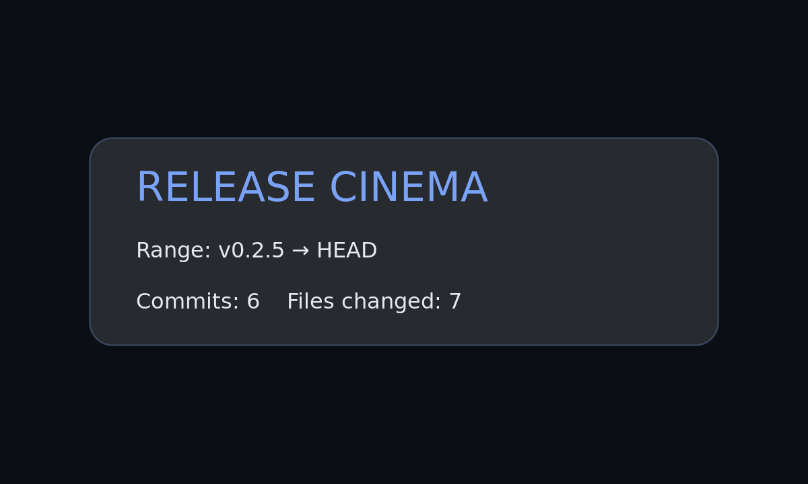

# Release Cinema

> Make your releases **cinematic**. Zero‑dep Node CLI + GitHub Action that renders a short trailer (GIF/MP4) summarizing a tag’s highlights **and** a **CLI simulation** of the release run.

[](https://github.com/hunt3r157/release-cinema/actions/workflows/ci.yml)
[](https://github.com/hunt3r157/release-cinema/actions/workflows/release.yml)
[](https://www.npmjs.com/package/release-cinema)
[](LICENSE)
[](https://ko-fi.com/hunt3r157)


---

## Table of Contents
- [Overview](#overview)
- [Requirements](#requirements)
- [Install](#install)
- [Quick Start](#quick-start)
- [Usage](#usage)
  - [Commands](#commands)
  - [Common Flags](#common-flags)
  - [Exit Codes](#exit-codes)
- [GitHub Action](#github-action)
- [Outputs](#outputs)
- [Examples / Gallery](#examples--gallery)
- [Configuration](#configuration)
- [FAQ / Troubleshooting](#faq--troubleshooting)
- [Security](#security)
- [Roadmap](#roadmap)
- [Contributing](#contributing)
- [License](#license)
- [Links](#links)

## Overview
Release Cinema turns a commit/tag range into:
- A **cinematic trailer** (PNG frames → **GIF/MP4**) that highlights:
  - Top commits (subject lines)
  - Top contributors
  - Files changed & top directories
- A **CLI “release run” simulation** GIF (tag → push → CI steps)
- A **pure analysis** mode that prints JSON (no rendering)

It’s a **zero-dependency Node CLI** at runtime (shells out to system tools) and works locally or in CI.

## Requirements
- **Node**: 20+
- **git** on PATH
- **ImageMagick** and **ffmpeg** on PATH  
  - macOS: `brew install imagemagick ffmpeg`  
  - Ubuntu: `sudo apt-get update && sudo apt-get install -y imagemagick ffmpeg fonts-dejavu-core`

## Install
Use one-off with npx:
```bash
npx release-cinema --help
```

Or add to your project:
```bash
# npm
npm i -D release-cinema
# pnpm
pnpm add -D release-cinema
# bun
bun add -d release-cinema
```

## Quick Start
Render a trailer for the last tag → `HEAD` and a CLI simulation:
```bash
# trailer (GIF/MP4) and CLI simulation (GIF)
npx release-cinema render --auto --out-dir assets
npx release-cinema simulate --out assets/cli_sim.gif
```

## Usage

### Commands
```bash
release-cinema render    # produce PNG frames -> GIF/MP4 via ImageMagick/ffmpeg
release-cinema simulate  # produce animated terminal simulation GIF
release-cinema analyze   # print JSON analysis only (no rendering)
```

### Common Flags
| Flag | Applies to | Description |
|------|------------|-------------|
| `--auto` | render / analyze | Auto-detect previous tag → `HEAD` |
| `--from <tag|sha>` | render / analyze | Explicit start of range |
| `--to <tag|sha>` | render / analyze | Explicit end of range (default `HEAD`) |
| `--out-dir <path>` | render | Output directory for trailer assets (default `assets`) |
| `--out <file>` | simulate | Output GIF path for the CLI simulation |

**Examples**
```bash
# explicit range
release-cinema render --from v0.1.0 --to v0.1.1 --out-dir assets

# analysis only (great for debugging)
release-cinema analyze --from v0.1.0 --to v0.1.1
```

### Exit Codes
- `0` success  
- `2` runtime error (e.g., not a git repo)

## GitHub Action
Attach a trailer + CLI simulation to every GitHub Release created from a tagged push:
```yaml
name: Release
on:
  push:
    tags: ["v*.*.*"]
jobs:
  cinema:
    runs-on: ubuntu-latest
    permissions:
      contents: write
    steps:
      - uses: actions/checkout@v4
      - uses: actions/setup-node@v4
        with: { node-version: 20 }
      - name: Install render tools
        run: sudo apt-get update && sudo apt-get install -y imagemagick ffmpeg fonts-dejavu-core
      - name: Render trailer & CLI sim
        run: |
          node bin/release-cinema.mjs render --auto --out-dir assets
          node bin/release-cinema.mjs simulate --out assets/cli_sim.gif
      - name: Attach to Release
        uses: softprops/action-gh-release@v1
        with:
          files: |
            assets/trailer.gif
            assets/trailer.mp4
            assets/cli_sim.gif
```

## Outputs
By default, you’ll get:
- `assets/trailer.gif`
- `assets/trailer.mp4`
- `assets/cli_sim.gif`

## Examples / Gallery
> These files can be generated locally or by the Action and committed to `assets/`.




## Configuration
- **Range selection**  
  - Use `--auto` for previous tag → `HEAD`, or specify `--from/--to`.
- **Output control**  
  - Use `--out-dir` to choose where trailer assets are written.  
  - Use `simulate --out` to pick the simulation GIF path.
- **CI rendering**  
  - Ubuntu runners install `fonts-dejavu-core` to normalize font rendering.

## FAQ / Troubleshooting
**ImageMagick or ffmpeg not found**  
Install them (see Requirements) and ensure they’re on `PATH`.

**No prior tag found when using `--auto`**  
Create an initial tag first: `git tag v0.1.0 && git push --tags`.

**CI font/rendering looks different**  
Use the workflow above (installs `fonts-dejavu-core`).

**“Not a git repository” or empty analysis**  
Run commands from a repo with the history/tags you expect.

## Security
No network calls. The CLI reads local `git` metadata and shells out to ImageMagick/ffmpeg to render media.

## Roadmap
- Per-frame theme customization  
- Optional SVG-only output  
- “Typewriter” speed controls for simulation  
- Attach artifacts with SHA-pinned action

## Contributing
PRs welcome! A good place to start:
1. Open an issue describing the change.
2. Fork and create a feature branch.
3. If your change affects rendering, update assets and include before/after screenshots or GIFs in the PR.
4. If relevant, run the GitHub Action from your fork to validate attachments.

## License
MIT © Release Cinema contributors

## Links
- **npm**: https://www.npmjs.com/package/release-cinema  
- **GitHub Releases**: https://github.com/hunt3r157/release-cinema/releases  
- **Issues**: https://github.com/hunt3r157/release-cinema/issues


<!-- GALLERY:START -->
## Gallery

| Latest Trailer | CLI Simulation |
| --- | --- |
| [](assets/trailer.mp4) |  |

_Last updated: 2025-08-18 • Range: `v0.2.5` → `HEAD`_
<!-- GALLERY:END -->
